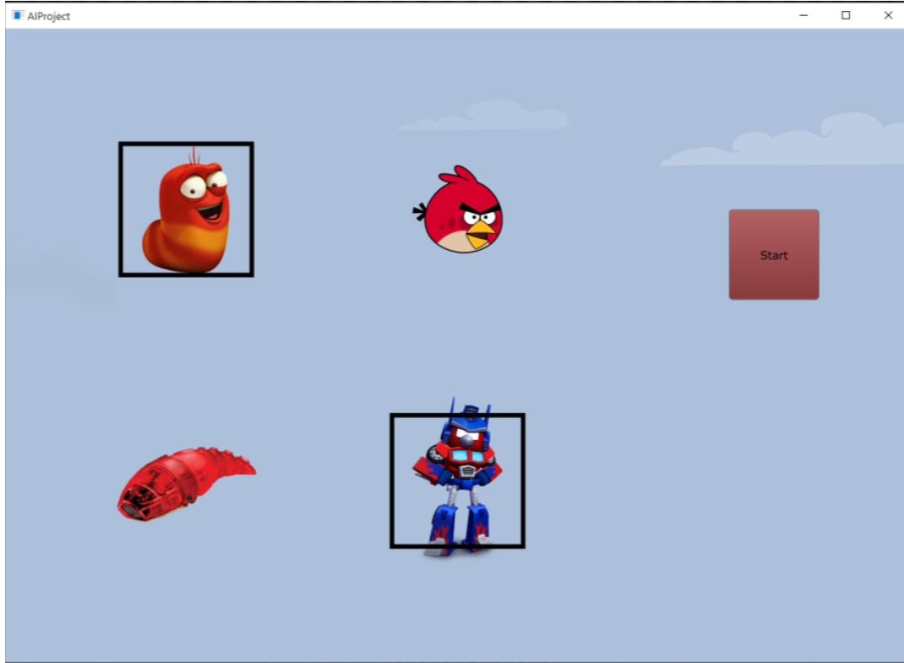
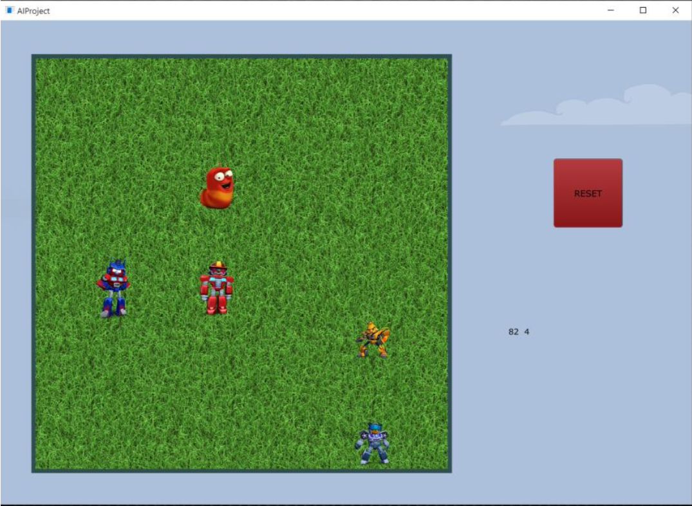
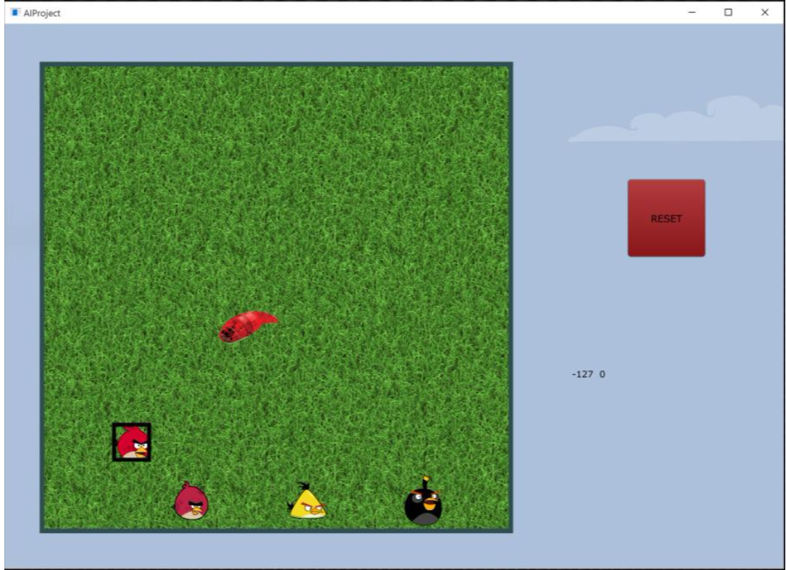
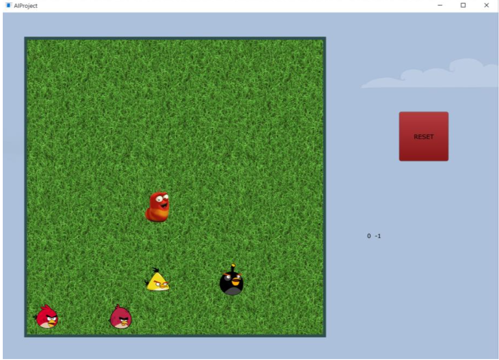
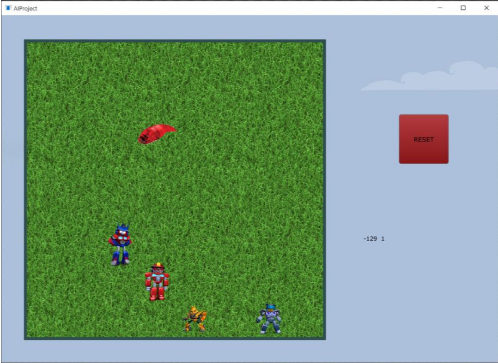

# AI Minmax Game  COMP 472  Artificial Intelligence
## Game Rules
1. 2 Player game.
2. Game board 8x8.
3. The larva has to reach the last row on the board for it to win, and the birds needs to prevent that from happening.
4. AI move must take at most 3 seconds.
## How to Run the Game
After running the executable file (exe) of the game, a main menu screen will display 4 images of players:
- Living Larva (human entry of Larva’s moves)
- Robot Larva (AI entry of Larva’s moves)
- Normal Angry Birds (human entry of Birds’ moves)
- Transformers Angry Birds (AI entry of Birds’ moves)

Before starting the game, the user has to choose an option for each player (larva and birds). Screenshots can be seen below.
- Human Larva vs Human Birds
- AI Larva vs Human Birds
- Human Larva vs AI Birds
- AI Larva vs AI Birds

When the game starts if the player’s turn is in AI mode then the AI will automatically make the move. If the player is in human mode then the player has to input the next move.
- If it is Human Larva’s turn, the player can press where the next move of the larva is. If the move is legal then the Larva changes its move.
- If it is Human Bird’s turn, the player first has to press on the bird he/she wants to move. A black square will be drawn around the selected bird. The player can change the selected bird simply by pressing on another bird, and the black square will be highlighting the new selected bird. After the user chooses the bird he/she wants to move, the user can press where the next move of the bird is, if the move is legal then the selected bird changes its move.

If any move entered by the user is illegal, then nothing will happen and the user will still have to enter a legal move for player.

## Programming Language
The programming language used for developing this game is C++. For the GUI, Juce library was used; a powerful, robust and cross-platform library. ( http://www.juce.com/ )

## AI Algorithm
The detailed descriotion of the algorithm and the implementation can be found in the pdf file Project_Report.pdf

## Screenshots
### Main Menu

### Human Larva vs AI Birds

### AI Larva vs Human Birds

### Human Larva vs Human Birds

### AI Larva vs AI Birds

